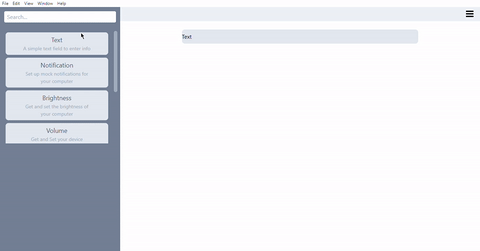

# CrustAPI - Desktop Scripting and Automation

CrustAPI is a powerful tool for automating various functions and actions on your desktop computer. This app is built using VueJS, Electron, and Tailwindcss to deliver a seamless and responsive user experience.

With the CrustAPI desktop app, you can create custom scripts to perform a wide range of tasks, from simple mouse and keyboard actions to complex system functions using the intuitive flowchart system. Easily create scripts by dragging and dropping function blocks into the workspace. Run your scripts instantly or schedule them to run at a specific time.



### Requirements

- Node.js and npm
- Electron (installed via npm as a dev dependency)

### Getting Started

1. Clone the repository and install dependencies:

```
git clone https://github.com/Flamz23/CrustAPI
cd CrustAPI
npm install
```

2. Run the app in development mode:

```
npm run electron:serve
```

### Building for Production

To build the app for production, run:

```
npm run electron:build
```

### TODO

- ~~Native notifications~~
- ~~Error dialog~~
- ~~Info dialog~~
- ~~Brightness level~~
- ~~Device Info~~
- Wifi (on and off)
- Wifi (connect and disconnect)
- Bluetooth (on and off)
- Bluetooth (connect and disconnect)
- Do not Disturb
- Low power mode
- Volume and mute controls
- Play sound
- SSH
- Get Battery Level
- Current Network details
- ~~clipboard~~
- ~~volume level~~
